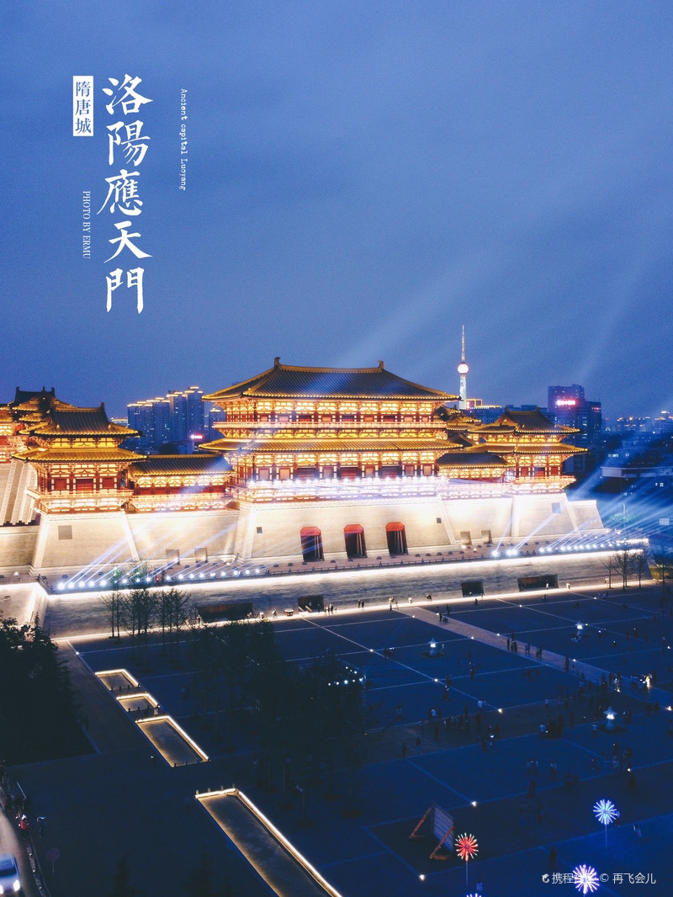
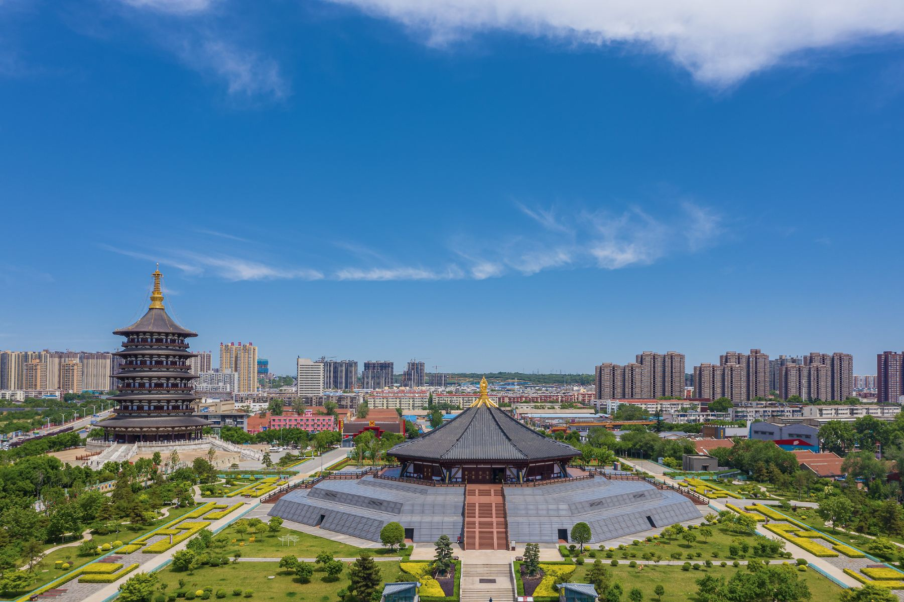
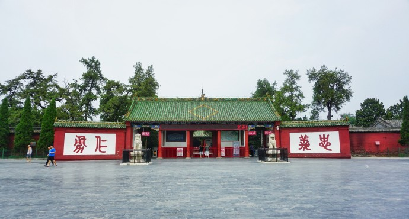
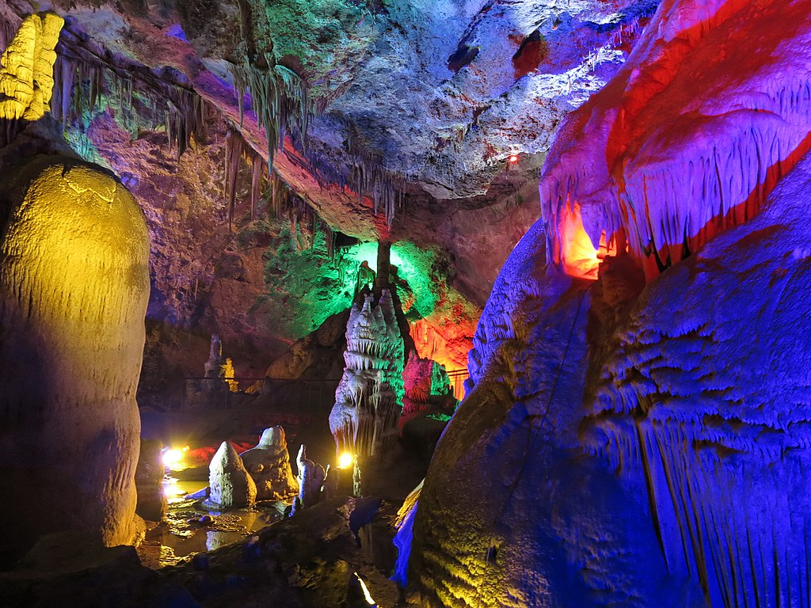
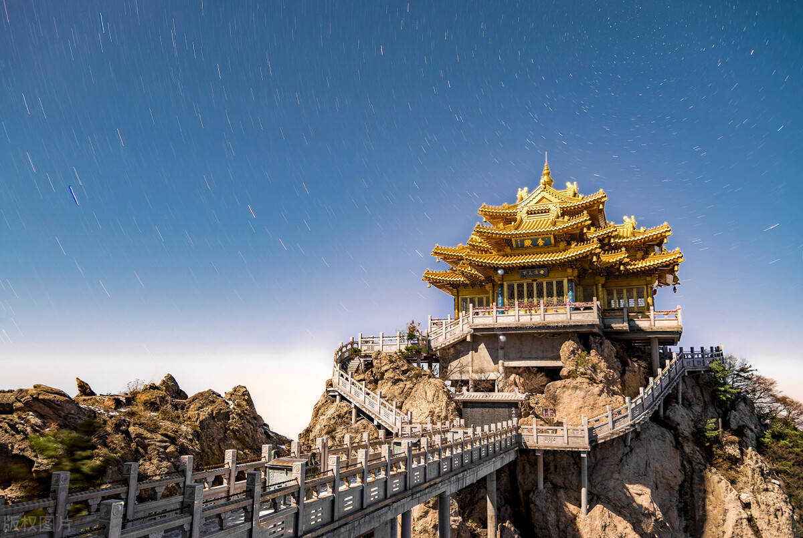

# 洛阳

## 景点

- 白马寺
  - 位于洛阳市瀍河回族区白马寺镇310国道边。
  - 白马寺创建于东汉永平十一年（公元68年），是佛教传入中国后兴建的第一座寺院，白马寺建立之后，中国“僧院”便泛称为“寺”，白马寺也因此被认为是中国佛教的发源地，有中国佛教的“祖庭”和“释源”之称。
  - 汉明帝在64年派人去天竺寻找佛法。他们在西域遇到了天竺的僧人，得佛经佛像，相偕同行，以白马驮经，于67年抵达京城洛阳。汉明帝为高僧建造了一个天竺风格的建筑群，用作居住和翻译经书的地方，以僧人们暂住的“鸿胪寺”的“寺”字称之，为了纪念白马驮经之功，便命名为“白马寺”。
  - 寺内保存了大量元代夹纻干漆造像如三世佛、二天将、十八罗汉等，弥足珍贵。
    

- 隋唐洛阳城遗址
  - 位于洛阳市老城区中州中路定鼎路与中州路交汇处
  - 隋唐洛阳城始建于隋炀帝大业元年（公元605年），盛于唐朝，特别是女皇武则天统治时期，距今已有1400多年历史，历史文化价值深厚。它曾是中国隋代大运河中心、丝绸之路的东方起点，拥有成熟的洛南里坊制度，宏伟壮观的城市中轴线和星罗棋布的名人园林。
    

- 应天门
  - 洛阳市老城区定鼎南路23号

- 丽景门
  - 位于洛阳市老城区西关丽景门。
  - 丽景门始建于金代1217年，历史上金明丽景门城楼屡经毁败，屡经修复。今日的丽景门是市政府于2002年在金元明清时期的丽景门原址重建的，是一座重现古都洛阳风貌的城楼。
  - 整个丽景门景区由城门楼、瓮城、箭楼、城墙和丽景桥（古时为吊桥），护城河等部分组成，其城垣高厚，月城宏阔，重门叠关，上干浮云，气势磅礴，成为洛阳老城历史文化古城街区的龙头。
    

- 洛阳老街
  - 位于洛阳市老城区正义街(农校街小学东北侧约50米)。
  - 老街文化形成于金中京，是在隋唐东都的东城旧址上兴建的，距今已有三千多年的历史。
  - 洛阳老街保存着原始的面貌，往来的人群，吆喝叫卖的小贩和两旁林立的商铺，处处充满了古都的味道。
    

- 洛阳博物馆
  - 位于洛阳市洛龙区聂泰路。
  - 洛阳博物馆位于城市的中轴线上，采用"鼎立天下"的设计理念，整体建筑外观为大鼎造型，以非对称的空间结构为支撑，借鉴园林手法在方形流线的转折位置设置庭院和采光天井，使空间布局达成动态的均衡。
  - 博物馆展出文物1.1万余件。以中华文明的源头和最具代表性的河洛文化为主体，收藏上起仰韶文化、龙山文化和夏商时期、下至明清、民国的文物，朝代跨度在国内地级市博物馆中首屈一指。其馆藏特色为玉器、青铜器、石刻、汉陶俑、唐三彩及清代宫廷用品等。
    

- 天子驾六博物馆
  - 位于洛阳市西工区人民东路与人民西路中间，中州路北侧。
  - 是一座以原址保护展示的东周时期大型车马坑为主体，辅展以东周王城概况、王陵考古的新发现及部分东周时期珍贵文物的“王城、王陵、王器”专题博物馆。
  - 以东周王城遗址出土的“天子驾六”车马坑命名，在遗址中共发现21座中型古墓葬和2座车马坑，当地采取了就地建馆的方式对这些遗物进行保护。
    

- 周公庙博物馆
  - 位于洛阳市老城区定鼎南路与凯旋东路交叉口东。
  - 洛阳周公庙博物馆是在洛阳周公庙的基础上建立的一座弘扬周公文化、展示周公史迹的专题博物馆。始建于隋末唐初，是祭祀周公的祠庙，亦称元圣庙。
    

- 关林庙
  - 位于河南省洛阳市洛龙区关林镇。
  - 为埋葬三国时蜀将关羽首级之地，前为祠庙，后为墓冢，为海内外三大关庙之一，千百座关庙中独称“林”，是中国唯有的冢、庙、林三祀合一的古代经典建筑。
    

- 龙门石窟
  - 位于洛阳市洛龙区龙门镇龙门大道。
  - 龙门石窟是中国三大石刻艺术宝库之一，同时被誉为世界最伟大的古典艺术宝库之一，与甘肃敦煌莫高窟、山西大同云岗石窟等中国著名石窟列为世界文化遗产。
  - 龙门由大禹治水中所开凿，鱼跃龙门的传说亦发生于此。其石窟则始凿于北魏孝文帝年间，盛于唐，终于清末。历经10多个朝代陆续营造长达1400余年，是世界上营造时间最长的石窟之一。现存洞窟像龛2345个，造像11万余尊，建造时采用了大量彩绘，今大多已褪色。
  - 龙门石窟造像多为皇家贵族所建，是世界上绝无仅有的皇家石窟。主要有武则天根据自己的容貌雕刻的卢舍那大佛、孝文帝为冯太后凿古阳洞、兰陵王孙于万佛洞造像、李泰为长孙皇后造宾阳南洞、韦贵妃凿敬善寺、高力士为唐玄宗造无量寿佛等。又经历天竺、新罗、吐火罗、康国等外国人开窟造像，发现有欧洲纹样、古希腊石柱等，堪称全世界国际化水平最高的石窟。
    

- 鸡冠洞
  - 位于洛阳市栾川县，县城西三公里，秦岭余脉伏牛山支脉鸡冠山的半山腰上。
  - 鸡冠洞是一处大型的石灰岩溶洞，喀斯特岩溶地貌，发现于清朝乾隆年间。
    

- 老君山
  - 位于洛阳市栾川县。
  - “天下无双圣境，世界第一仙山”。老君山古号“景室山”，取八百里伏牛山美景集于一室之意，因道家始祖老子归隐修炼于此，后更名为“老君山”，沿袭至今。
  - 春秋时期，被公认为道教始祖的老子李耳到此归隐修炼，使之成为“道源”和“祖庭”。北魏始于其上建老君庙以纪念。贞观十一年（637年），唐太宗重修景室山铁顶老君庙，赐名“老君山”，成为道教主流全真派圣地。万历三十一年（1603年），明神宗诏谕老君山为“天下名山”，并发帑金建殿，成为历史上唯一被皇封为“天下名山”的中国山脉。
    

## 路线

白马寺（2-3小时） → 洛阳周王城天子驾六博物馆（1.5小时） → 隋唐洛阳城国家遗址公园（3小时） → 丽景门（2小时） → 洛阳老街（2小时）

洛阳博物馆（2小时） → 关林庙（2小时） → 龙门石窟（4小时） → 功夫诗九卷（1.5小时）

洛阳伏牛山滑雪度假乐园（3-5小时）

老君山风景名胜区（4-6小时）
