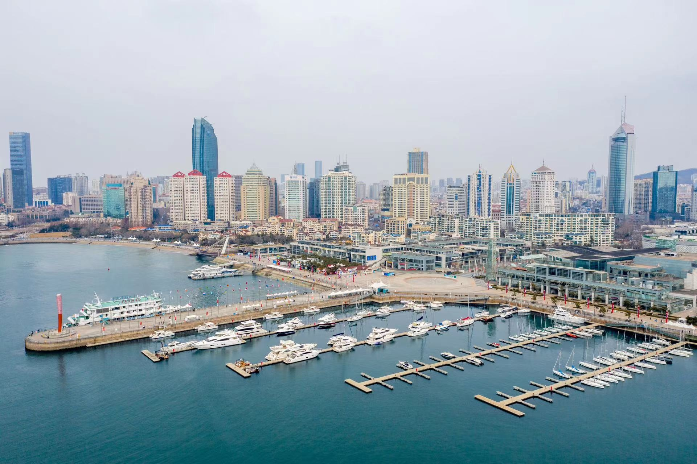

# 青岛

## 地点

### 景点

- 青岛啤酒博物馆：
  - 市北区登州路56号-1。
  - 是在国家重点文物保护单位青岛啤酒厂早期建筑的基础上建设而成的中国第一家以啤酒为主题的的博物馆。
  - 

- 圣弥厄尔大教堂：
  - 市南区浙江路15号。
  - 青岛天主教堂平面呈十字形，教堂主体两翼，各耸一座尖塔，塔高56米，顶端各立有一个4.5米高的巨型十字架。大厅高18米，可纳千人，内部采用意大利文艺复兴时期的装饰，穹顶绘以圣像壁画。青岛天主教堂是青岛地区最大的天主教堂和哥特式建筑，也是中国唯一的祝圣教堂。
  - 

  - 

- 信号山:
  - 市南区齐东路17号、龙口路16号甲。
  - 山顶处3幢红色蘑菇楼宛如3支熊熊燃烧的火炬，耸立于青松、绿树丛中，格外醒目。
  - 背依市区，前临大海，远眺栈桥，是观赏前海景区和市区风貌的最佳观景点之一。
  - 

  - 

- 小鱼山：
  - 市南区鱼山路和福山路。
  - 山虽不高却能远眺，登山俯瞰，自西向东可以看到沿海的一系列美景：栈桥、小青岛、鲁迅公园、水族馆、汇泉湾、第一海水浴场、八大关景区等，前海美景尽收眼底。
  - 

  - 

- 栈桥：
  - 市南区青岛湾内，入口位于太平路14号。
  - 栈桥及回澜阁全长440米，宽10米，桥两边有铁链护栏和莲花路灯，尽头建有半圆形三角防波堤，呈“个”状，最南端处筑有双层双檐琉璃瓦覆顶的两层八角亭名为回澜阁。
  - 

- 八大关（第二海水浴场）：
  - 市南区汇泉东部。
  - 八大关是最能体现青岛“红瓦绿树、碧海蓝天”特点的风景区，位于山东省青岛市汇泉角景区北部。八个关隘，八个地标；八种容颜，八种风情；八处景色，八处意境，一头通向遥远的边塞雄关，一边连着咫尺的海天蜃景。
  - 

- 第二海水浴场：
  - 也叫“太平角海水浴场”，与八大关别墅区相邻的一处沙滩浴场。
  - 

- 花石楼：
  - 市南区黄海路18号八大关风景区内
  - 建于临海岸岬角部位，地势突兀，三面临海，气势恢宏，已成为八大关风景疗养区的标志性建筑物。
  - 

- 公主楼：
  - 市南区居庸关路10号。
  - 一座丹麦式建筑，其外部由一组不规则斜顶屋面组成，南部为宽敞的方形露台，绿色外墙，宛如安徒生的童话世界。
  - 

- 音乐广场：
  - 位于浮山湾畔，东接五四广场，北临少儿活动中心。
  - 是我国最大的以音乐为主题的文化休闲广场。
  - 

- 五四广场：
  - 市南区东部。
  - 因纪念五四运动学生捍卫青岛主权的爱国行为而得名。
  - 

  - 

- 奥帆中心：
  - 位于浮山湾畔，毗邻五四广场和东海路。
  - 青岛奥林匹克帆船中心采用的一系列科技新技术。奥帆基地同样注重环境景观规划，通过三条南北向轴线即：西轴－海洋文化轴、中轴－欢庆文化轴 东轴－自然文化轴，组成了意向的“川”字。以“欢舞·海纳百川”为主题，寓意开放的青岛正以宽广胸襟，向世界敞开大门。
  - 

  - 

- 情人坝：
  - 奥林匹克帆船中心内。
  - 2008年北京奥运会帆船赛结束后，奥帆中心主防波堤规划成一处特色风情街，以中国奥运会帆板冠军定情地命名为“情人坝”。
  - 

- 小麦岛：
  - 崂山区麦岛路西50米。
  - 

- 石老人海水浴场：
  - 崂山区，9:00-18:00（17:30停止入场）。
  - 因左端海中巨石“石老人”得名，是青岛市“石老人国家旅游度假区”的一部分。是集度假、观光旅游、海上运动、沙滩运动、休闲娱乐为一体的综合性旅游度假海滩。
  - 

- 海昌极地海洋世界：
  - 石老人国家旅游度假区。
  - 拥有极地海洋馆，欢乐剧场，深海奇幻，5D动感体验馆，极地宝贝乐园等项目。

- 崂山风景区：
  - 位于崂山区，由巨峰、流清、太清、棋盘石、仰口、北九水、华楼等9个风景游览区和沙子口、王哥庄、北宅、夏庄、惜福镇等 5个风景恢复区及外缘陆海景点三部分组成。
  - 崂山十二景：巨峰旭照、龙潭喷雨、明霞散绮、太清水月、海峤仙墩、那罗佛窟、云洞蟠松、狮岭横云、华楼叠石、九水明漪、岩瀑潮音、蔚竹鸣泉。
  - 

### 餐厅

- 九龙餐厅
  - 市南区大沽路6号
  - 网红餐厅，招牌菜：辣蛤蜊、香辣鱿鱼条

- 林记小笼包
  - 大虾包

## 路线

### 1

三日游：

第1天：栈桥—天主教堂—大学路—信号山

第2天 八大关—第二海水浴场—五四广场

第3天：崂山—石老人海水浴场

### 2

Day1青岛东部游

小麦岛公园 — 燕儿岛 — 青岛奥帆中心-火炬码头 — 五四广场 — 情人坝

Day2青岛西部游

第三海水浴场 — 八大关 — 中山公园 -- 小鱼山公园 — 栈桥公园 — 台东商业步行街

Day3青岛老街风情

大学路 — 信号山公园 — 龙江路 — 青岛天主教圣弥厄尔大教堂 —平康五里

### 3

青岛啤酒博物馆 — 九龙餐厅（知乎网红餐厅）— 天主教堂 — 金麦园 — 信号山 — 中国海洋大学 — 小鱼山 — 小青岛公园 — 王姐烧烤 — 劈柴院 — 民宿 — 琴岛顺天

林记小笼包 — 邮政博物馆 — 栈桥 — 万和春 — 八大关（第二海水浴场） — 音乐广场 — 五四广场 — 奥帆中心 — 情人坝 — 波螺油子 — 夜的五四广场及音乐广场

双合园饺子 — 石老人海水浴场 — 春川铁板烧鸡

## 注意事项

- 携带物品（出门检查）：
  - 身份证
  - 现金
- 买票 & 预约：
  - 友艇小程序？
  - 美团App
  - “魅力海滨”公众号
- 住宿地点：
  - 中山路
  - 3号线地铁沿线
  - 五四广场
  - 劈柴院（小吃街，没啥特色）
