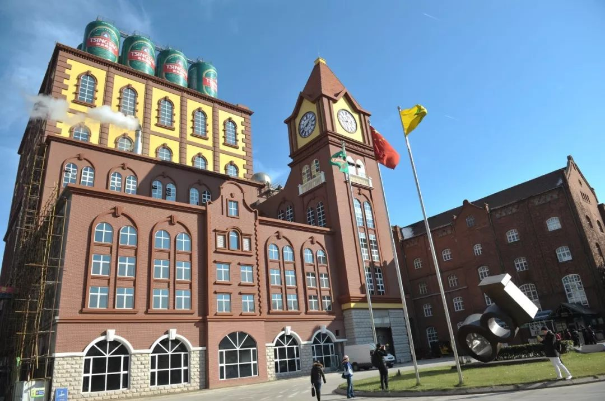
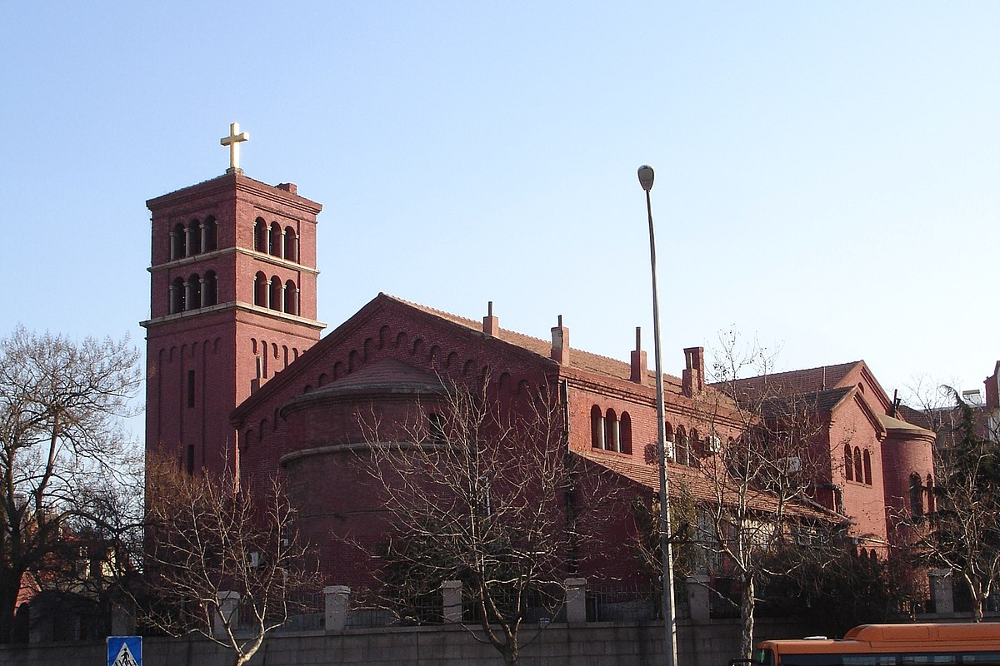
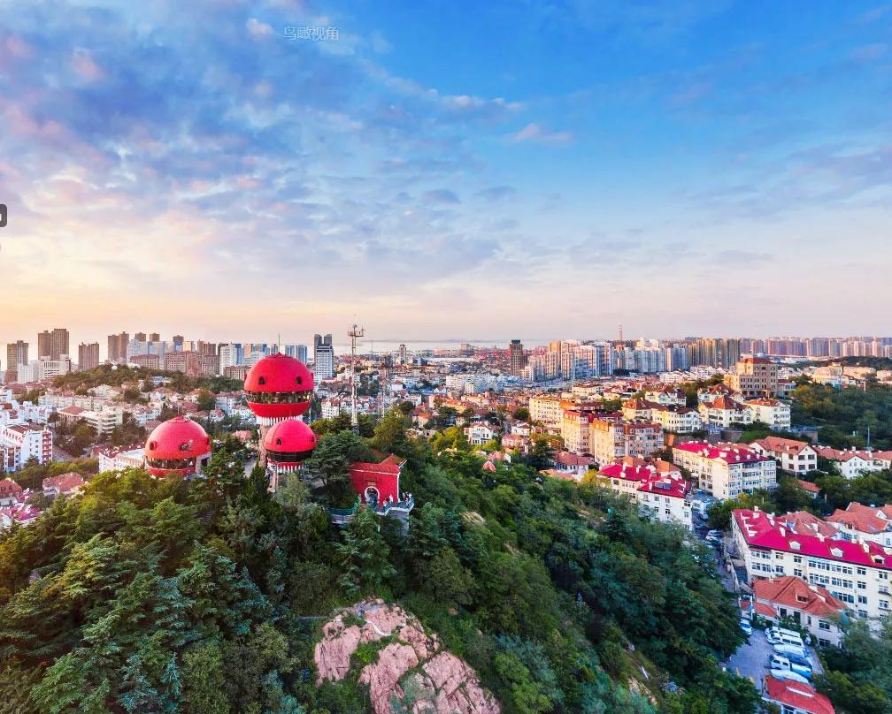
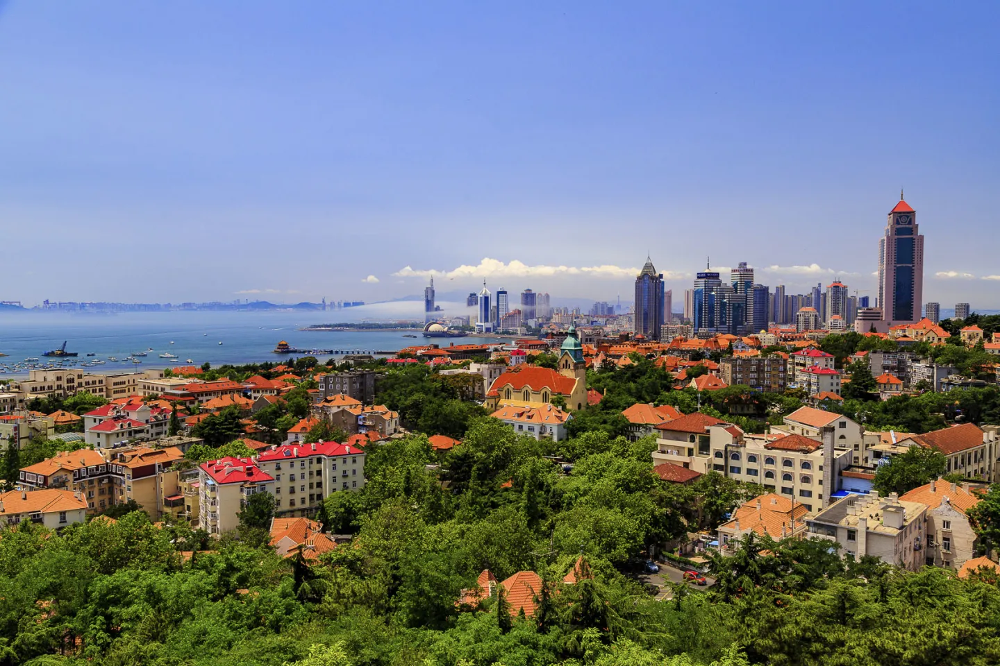
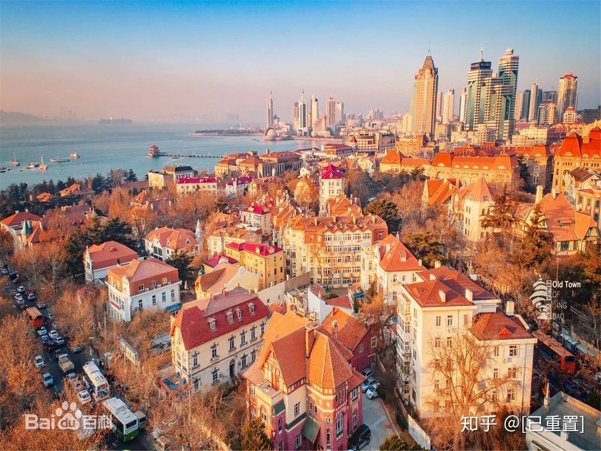
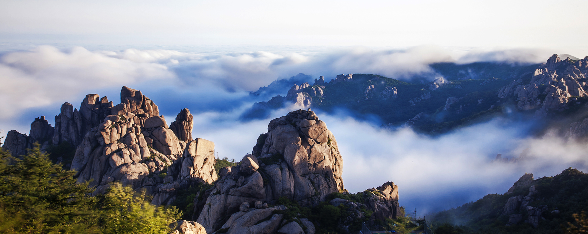
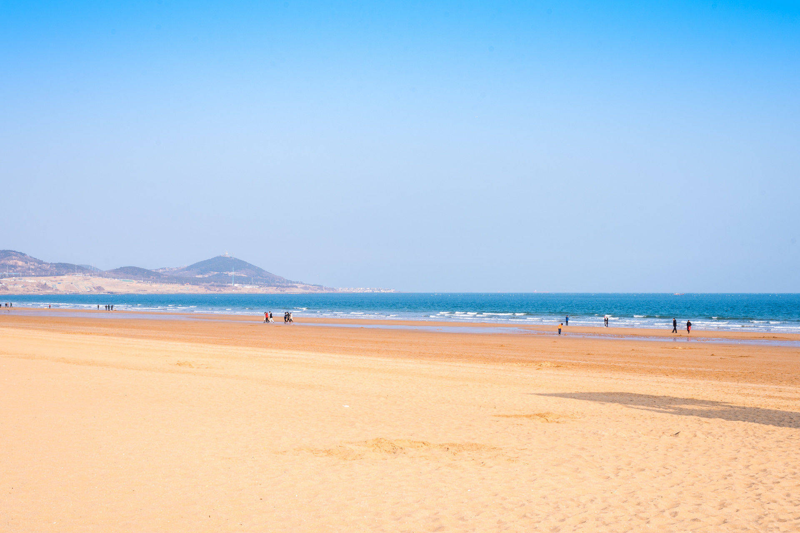
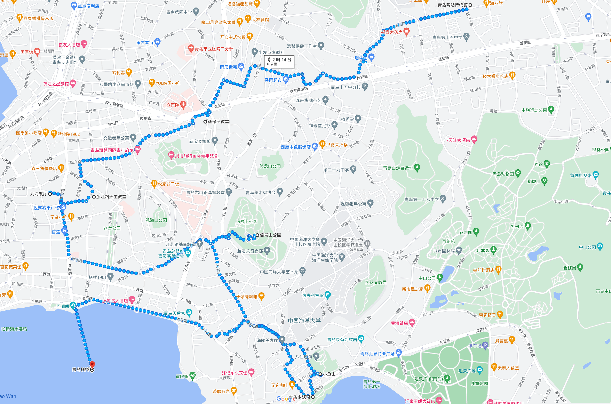
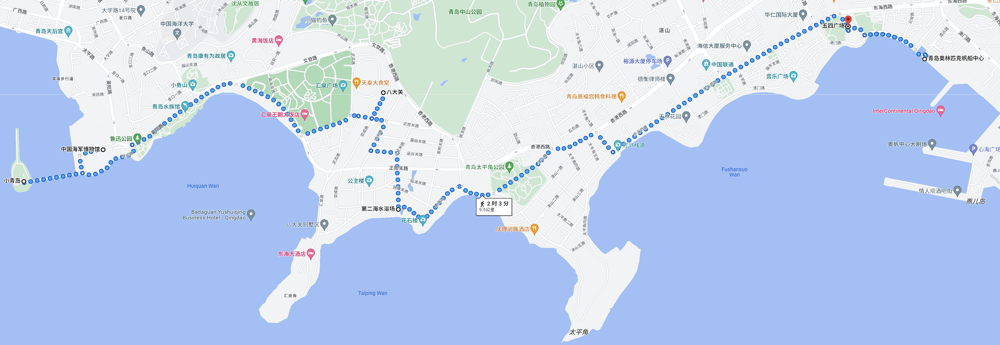

# 青岛

> Git 链接：<https://github.com/Chen-23333/Markdown/blob/master/Travel/QingDao.md>

## 景点

- 青岛啤酒博物馆：
  - 市北区登州路56号-1。
  - 是在国家重点文物保护单位青岛啤酒厂早期建筑的基础上建设而成的中国第一家以啤酒为主题的的博物馆。
  

- 圣保罗教堂：
  - 市南区观象二路1号。
  - 教堂平面为“L”形，分为南北两个大堂和一个钟楼，钟楼高24米，内部有60级台阶通往顶部。建筑整体为清水红砖外墙，建筑风格为罗曼式，外立面边角处有罗曼式教堂典型的“伦巴底带”，即连拱纹。整个教堂风格敦厚、雄壮，是青岛老城区经典的街道景观之一。
  

- 圣弥厄尔大教堂：
  - 市南区浙江路15号。
  - 青岛天主教堂平面呈十字形，教堂主体两翼，各耸一座尖塔，塔高56米，顶端各立有一个4.5米高的巨型十字架。大厅高18米，可纳千人，内部采用意大利文艺复兴时期的装饰，穹顶绘以圣像壁画。青岛天主教堂是青岛地区最大的天主教堂和哥特式建筑，也是中国唯一的祝圣教堂。
  

- 栈桥：
  - 市南区青岛湾内，入口位于太平路14号。
  - 栈桥及回澜阁全长440米，宽10米，桥两边有铁链护栏和莲花路灯，尽头建有半圆形三角防波堤，呈“个”状，最南端处筑有双层双檐琉璃瓦覆顶的两层八角亭名为回澜阁。
  

- 小鱼山：
  - 市南区鱼山路和福山路。
  - 山虽不高却能远眺，登山俯瞰，自西向东可以看到沿海的一系列美景：栈桥、小青岛、鲁迅公园、水族馆、汇泉湾、第一海水浴场、八大关景区等，前海美景尽收眼底。
  

  

- 海底世界：
  - 市南区莱阳路2号。
  - 在中国第一座水族馆——青岛水族馆的基础上扩建而成，包含梦幻水母宫，海洋生物馆，海豹馆，淡水生物馆，鲸馆，海底世界，海洋科技馆七大展馆，有约2000类、20000多件珍稀海洋生物标本，上千种、数万尾来自世界各地的珍稀海洋生物，还有长达82.6米的海底隧道。

- 信号山:
  - 市南区齐东路17号、龙口路16号甲。
  - 山顶处3幢红色蘑菇楼宛如3支熊熊燃烧的火炬，耸立于青松、绿树丛中，格外醒目。
  - 背依市区，前临大海，远眺栈桥，是观赏前海景区和市区风貌的最佳观景点之一。
  

  

- 海军博物馆：
  - 需要提前预约：[海军博物馆](https://www.hjbwg.com/home)。
  - 市南区莱阳路8号，东邻鲁迅公园，西接小青岛公园。
  - 中国人民解放军海军博物馆陆地面积141.1亩，海域面积225亩，主要分为室内、海上和陆上三大展区，建有人民海军历史基本陈列、主展馆广场、海军英雄广场、陆上装备展区和海上装备展区等。该博物馆雕塑位于主展馆后，名称《亮剑深蓝》，是海军英雄广场的一座大型英雄群雕。
  

- 八大关（第二海水浴场）：
  - 市南区汇泉东部。
  - 八大关是最能体现青岛“红瓦绿树、碧海蓝天”特点的风景区，位于山东省青岛市汇泉角景区北部。八个关隘，八个地标；八种容颜，八种风情；八处景色，八处意境，一头通向遥远的边塞雄关，一边连着咫尺的海天蜃景。
  

- 花石楼：
  - 市南区黄海路18号八大关风景区内
  - 建于临海岸岬角部位，地势突兀，三面临海，气势恢宏，已成为八大关风景疗养区的标志性建筑物。
  

- 公主楼：
  - 市南区居庸关路10号。
  - 一座丹麦式建筑，其外部由一组不规则斜顶屋面组成，南部为宽敞的方形露台，绿色外墙，宛如安徒生的童话世界。
  

- 第二海水浴场：
  - 也叫“太平角海水浴场”，与八大关别墅区相邻的一处沙滩浴场。
  

- 五四广场：
  - 市南区东部。
  - 因纪念五四运动学生捍卫青岛主权的爱国行为而得名。
  

  

- 奥帆中心：
  - 位于浮山湾畔，毗邻五四广场和东海路。
  - 青岛奥林匹克帆船中心采用的一系列科技新技术。奥帆基地同样注重环境景观规划，通过三条南北向轴线即：西轴－海洋文化轴、中轴－欢庆文化轴 东轴－自然文化轴，组成了意向的“川”字。以“欢舞·海纳百川”为主题，寓意开放的青岛正以宽广胸襟，向世界敞开大门。
  

- 情人坝：
  - 奥林匹克帆船中心内。
  - 2008年北京奥运会帆船赛结束后，奥帆中心主防波堤规划成一处特色风情街，以中国奥运会帆板冠军定情地命名为“情人坝”。
  

- 小麦岛：
  - 崂山区麦岛路西50米。
  

- 海昌极地海洋世界：
  - 石老人国家旅游度假区。
  - 拥有极地海洋馆，欢乐剧场，深海奇幻，5D动感体验馆，极地宝贝乐园等项目。

- 石老人海水浴场：
  - 崂山区，9:00-18:00（17:30停止入场）。
  - 因左端海中巨石“石老人”得名，是青岛市“石老人国家旅游度假区”的一部分。是集度假、观光旅游、海上运动、沙滩运动、休闲娱乐为一体的综合性旅游度假海滩。
  

- 崂山风景区：
  - 位于崂山区，由巨峰、流清、太清、棋盘石、仰口、北九水、华楼等9个风景游览区和沙子口、王哥庄、北宅、夏庄、惜福镇等 5个风景恢复区及外缘陆海景点三部分组成。
  - 崂山十二景：巨峰旭照、龙潭喷雨、明霞散绮、太清水月、海峤仙墩、那罗佛窟、云洞蟠松、狮岭横云、华楼叠石、九水明漪、岩瀑潮音、蔚竹鸣泉。
  

- 金沙滩：
  - 黄岛区金沙滩路。
  - 金沙滩水清滩平，沙细如粉，沙质为金黄色，是我国沙质最细、面积最大、风景最美的海水浴场之一，号称“亚洲第一滩”。
  

## 餐厅

- 小吃：
  - 锅贴
  - 火烧

- 九龙餐厅
  - 市南区大沽路6号，网红餐厅（天主教堂附近）
  - 招牌菜：辣蛤蜊、香辣鱿鱼条、五花肉炒比管

- 王姐烧烤总店
  - 中山路和德县路路口
  - 烤鱿鱼最赞

- 船歌鱼水饺
  - 连锁店
  - 黄花鱼、墨鱼、砺虾水饺
  
- 开海虾水饺
  - 大虾水饺

- 排骨米饭：万和春：
  - 连锁店

- 不推荐：
  - 中山路劈柴院
  - 登州路啤酒街
  - 各种海鲜排档

## 路线

> （）内的地点，可去可不去
### Day0

- 20.37 到达青岛站
- 坐地铁去往酒店，中途或者到达后可以去台东步行街

### Day1

- 上午：啤酒博物馆 - （圣保罗教堂） - 天主教堂 - 九龙餐厅
- 下午：信号山公园 - 海底世界 - （小鱼山） - （栈桥）
- 晚上：台东夜市

### Day2

- 上午：海军博物馆 - （小青岛）
- 下午：八大关 - 第二海水浴场 - 奥帆中心（情人坝等落日）
- 晚上：五四广场周边夜景

### Day3

- 上午：小麦岛
- 下午：极地海洋世界 - 石老人海水浴场
- 晚上：随意安排

### Day4

- 青岛站

## 注意事项

- 时间参考：
  

- 预约：
  - 海军博物馆需要提前在官网预约：<https://www.hjbwg.com/home>，不能穿拖鞋进入（鞋需要有鞋跟）
  - 啤酒博物馆、海洋公园等需要提前买票。
  - 信号山、小青岛可以当场在公众号预约。
  - 八大关内蝴蝶楼、公主楼等需要额外买票，联票在3点（还是4点，忘了）停售。
  - 海底世界在美团买的轮船的连票，不能直接扫码进入，需要单独兑换。
  - 海底世界的轮船的票，最终前往奥体中心，如果坐的话，建议晚上在附近看夜景。
  - 海底世界要同时买海底世界和水族馆的票，从水母馆进入。
  - 大部分需要门票的场景，5点半结束，最好提前规划时间。

- 住宿推荐：
  - 青岛站（交通方便，但是房型偏小，民宿居多，价格还行）
  - 3号线地铁沿线（交通方便）
  - 五四广场（有海景房，民宿居多，有的没有独卫，价格比较高）
  - CBD（中央商务区，公寓多，房型好，交通去海边需要半小时左右路程，价格还行）
