# Windows

Windows 中，部分基础软件安装方法，主要是环境变量的配置方式。

## JDK

### Introduction

1. JDK是开发工具，JRE是运行环境，JVM是提供运行环境的虚拟机：
    1. JVM: JVM 是 Java Virtual Machine(Java虚拟机) 的缩写。它是一个抽象的计算机，通过模拟CPU、内存等硬件资源，为Java字节码提供了一个运行环境，让Java程序可以在各种硬件和操作系统上移植运行。
    2. JDK: JDK 是 Java Development Kit 的缩写，Java开发工具包。它包括JRE以及开发人员需要的开发工具，例如编译器(javac)，打包工具(jar)等。
    3. JRE: JRE 是 Java Runtime Environment（Java运行环境）的缩写。它包括了JVM和Java类库，提供了Java程序运行所需要的环境。

2. JavaSE是Java的标准版，用于开发一般的桌面和商务程序。JavaEE是Java的企业版，用于开发大型业务系统。JavaME是Java的微型版，主要用于移动设备和嵌入式设备:
    1. JavaSE: JavaSE 是 Java Standard Edition（Java标准版）的缩写。它包括了核心API（比如基本数据类型、对象、异常处理）等，JavaSE 可以用来开发桌面应用。
    2. JavaEE: JavaEE 是 Java Enterprise Edition（Java企业版）的缩写。基于JavaSE的基础上，JavaEE 还提供了创建企业级应用所需要的API，例如 Servlet，JSP，EJB，JMS，Web Services 等。
    3. JavaME: JavaME 是 Java Micro Edition（Java微型版）的缩写。它是为了满足移动设备、嵌入式设备等小型设备的需求而产生的，JavaME提供了一套轻量级的API。

### Download

1. 前往[官网](https://www.oracle.com/cn/java/technologies/downloads/archive/)下载：
    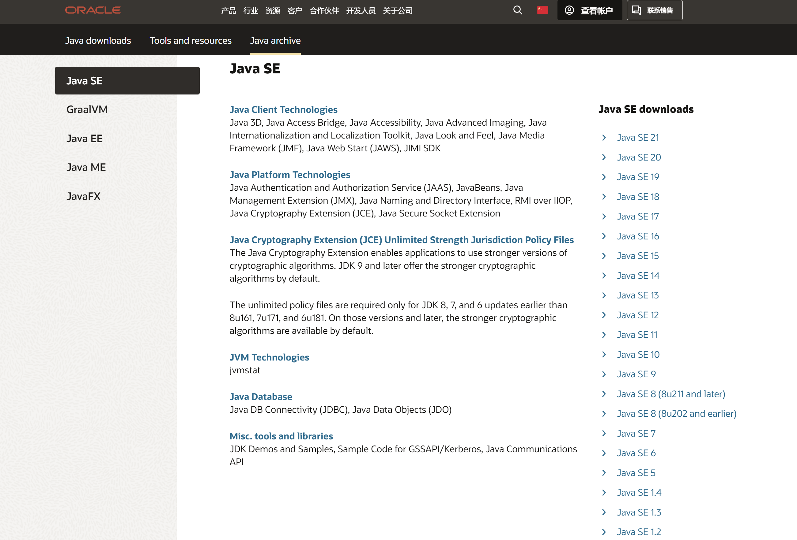

2. 使用安装器安装：
    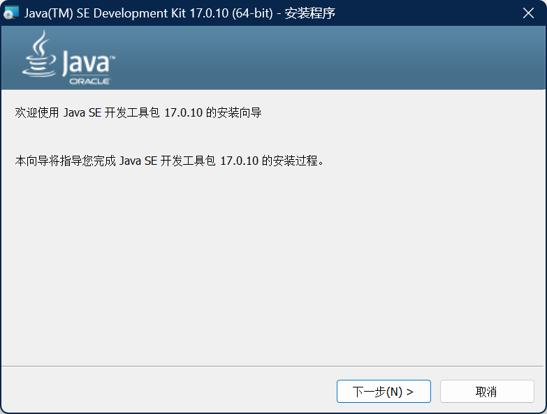

3. 配置环境变量：
    1. 新增 JAVA_HOME 变量：
    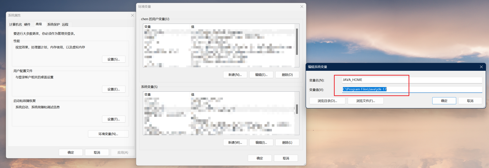
    2. 配置 Path：
       1. 需要注意此处配置路径时，高版本(如 jdk-17)，仅需配置 `%JAVA_HOME%\bin` 即可，低版本（如 jdk-8）可能还需要额外配置 `%JAVA_HOME%\jre\bin`，请以实际为准。
       2. 系统有可能额外配置了其他 Java 环境路径，如 `C:\Program Files (x86)\Common Files\Oracle\Java\javapath`， 需要手动删除。
    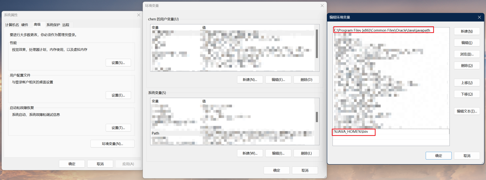

4. 验证：
    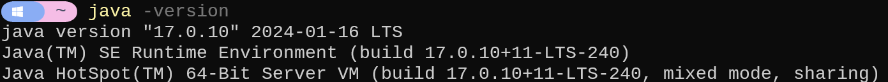

## Make

1. 前往[官网](https://gnuwin32.sourceforge.net/packages/make.htm)下载：
    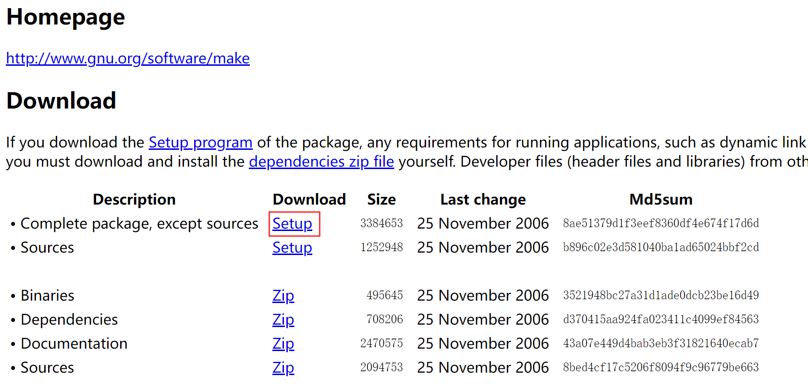

2. 使用安装器安装：
    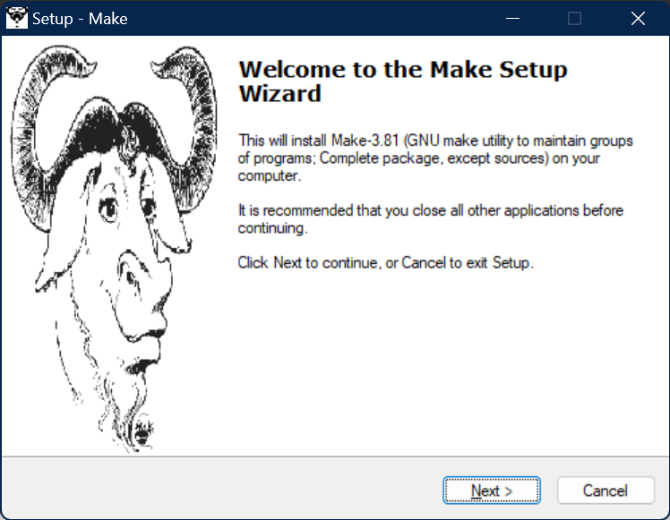

3. 配置环境变量：
    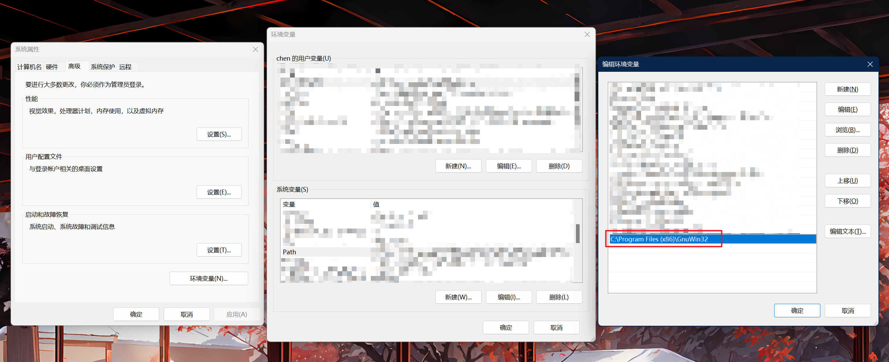

4. 验证：
    

## Neo4j

1. 安装 JDK，按照上述步骤安装即可，需要注意版本匹配，参考[requirements-java](https://neo4j.com/docs/operations-manual/5/installation/requirements/#deployment-requirements-java)：
    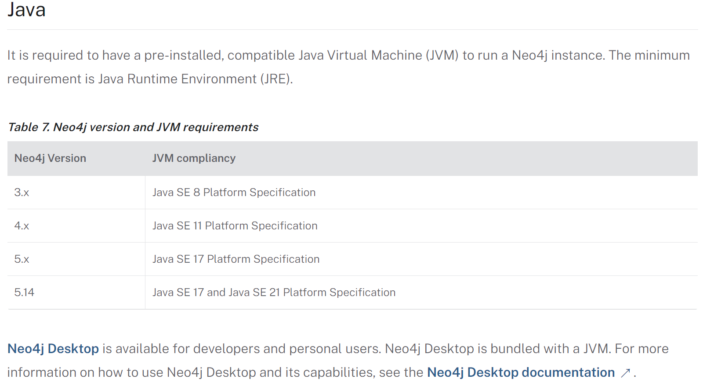

2. 前往[官网](https://neo4j.com/deployment-center/#gdb-tab)下载社区版：
    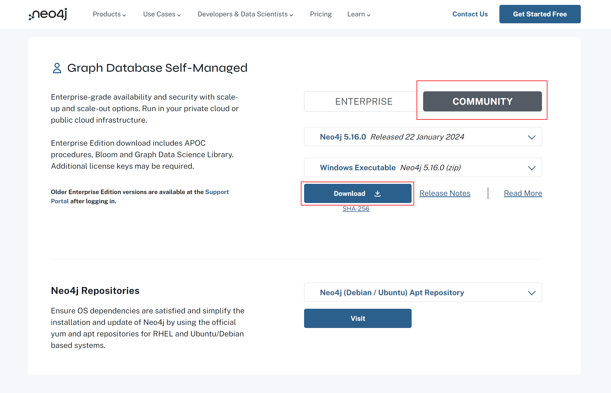

3. 下载得到的 zip 文件，直接解压缩即可，因为涉及到文件写权限，推荐放在非系统盘。

4. 配置环境变量：
    1. 新增 NEO4J_HOME 变量（注意要是上述压缩文件解压后的地址）：
    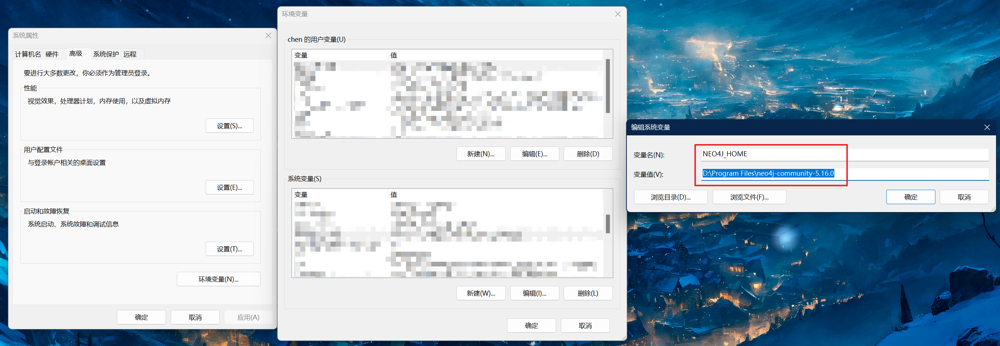
    2. 配置 Path：
    

5. 启动`neo4j.bat console`：
    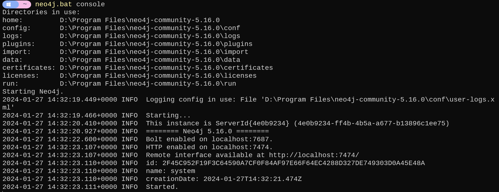

6. 进入 neo4j 的部署页面，即启动时所提示的 `http://localhost:7474`。
    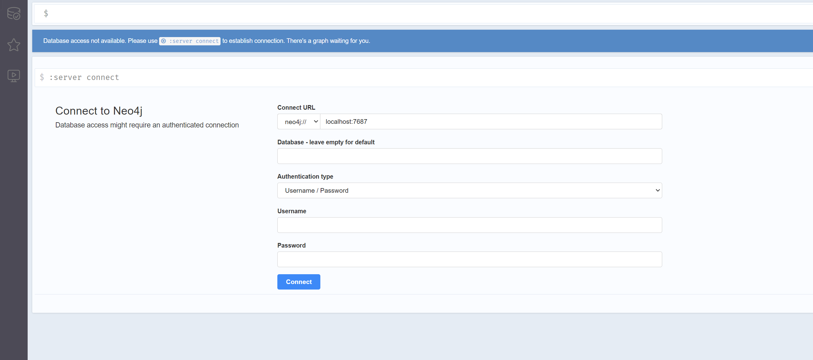

7. 登录，默认的用户名和密码均为 `neo4j`。
