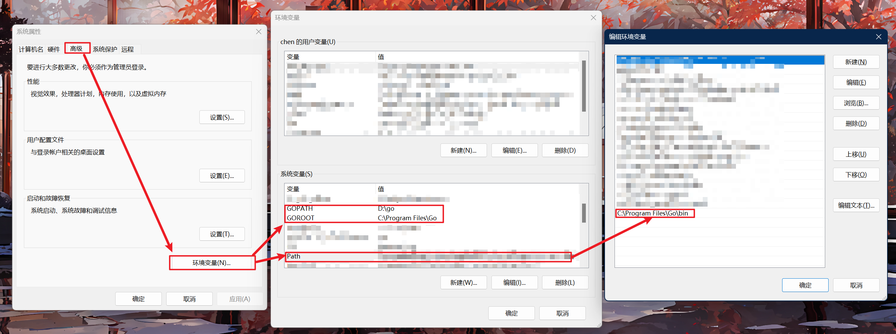
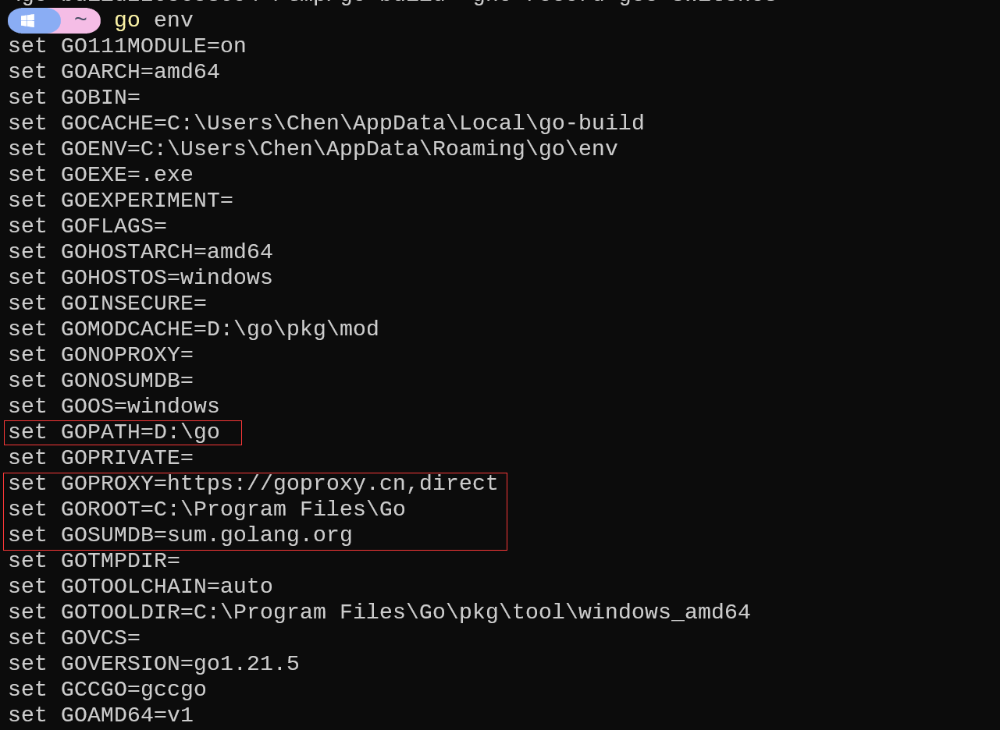
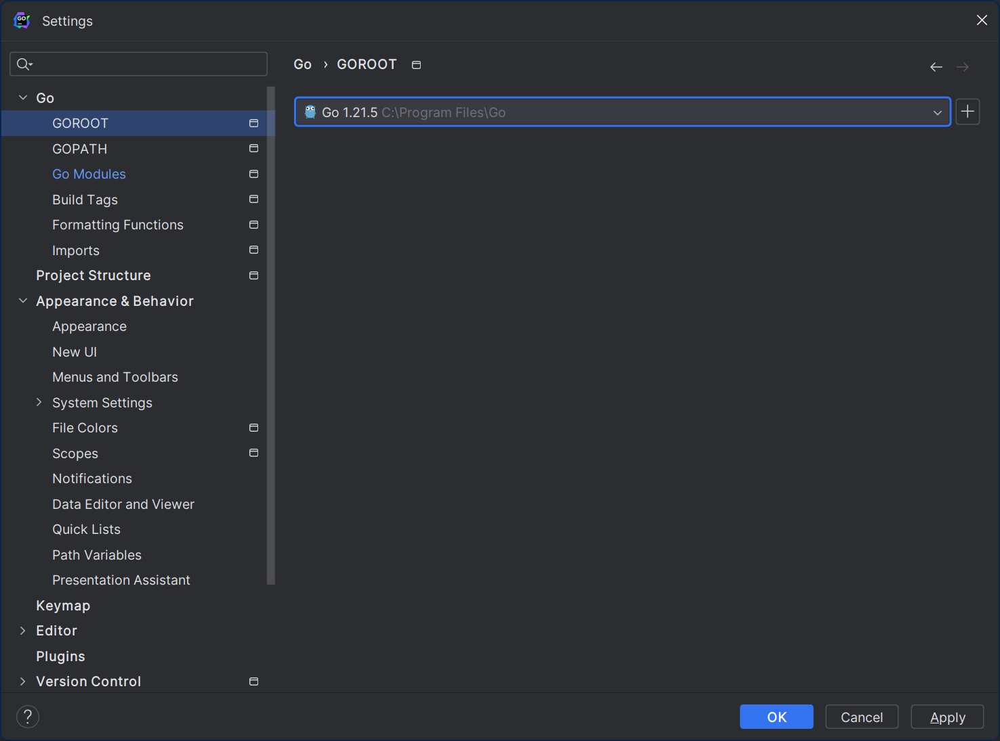
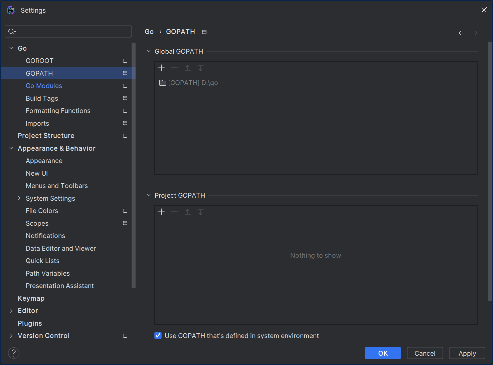
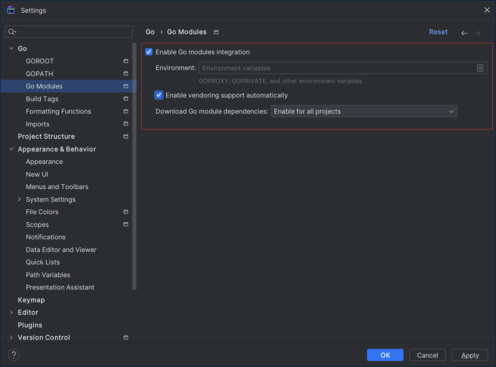
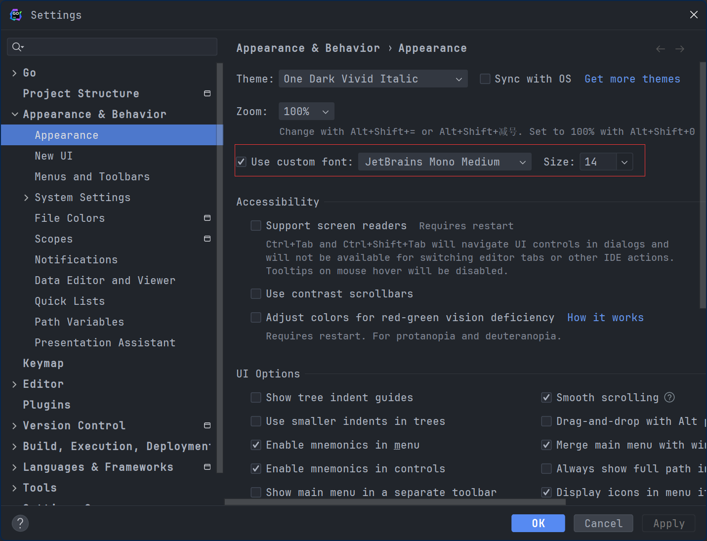
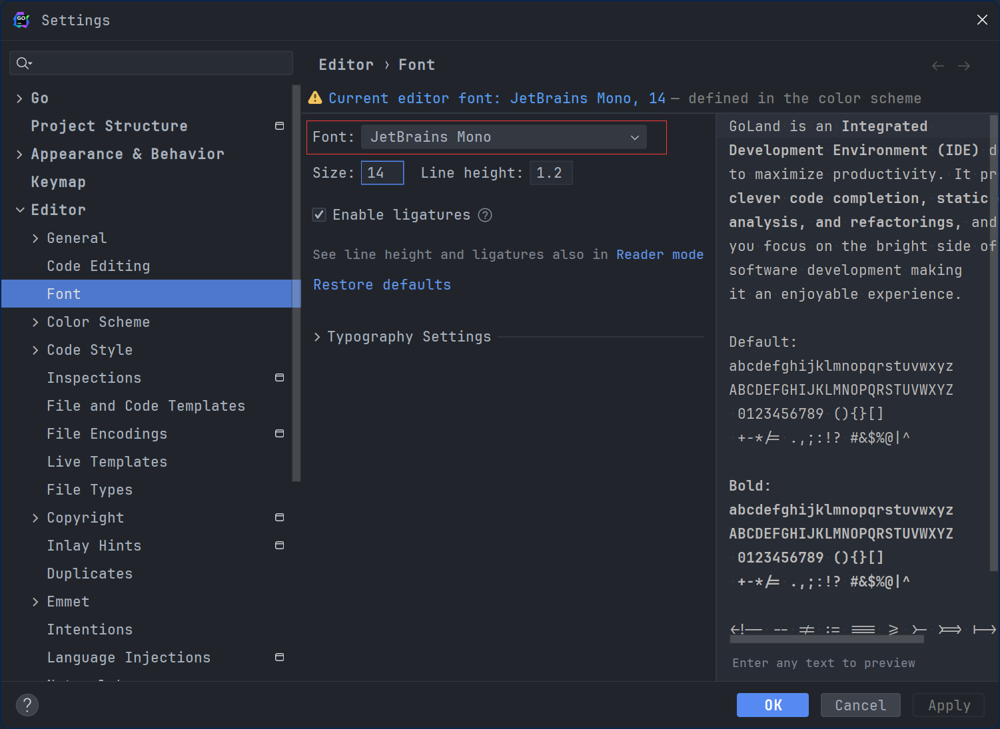
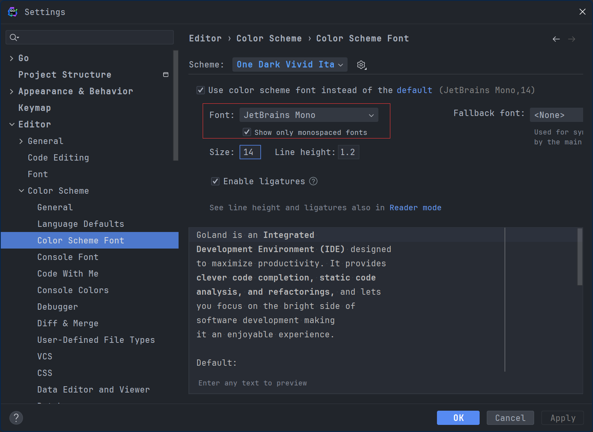
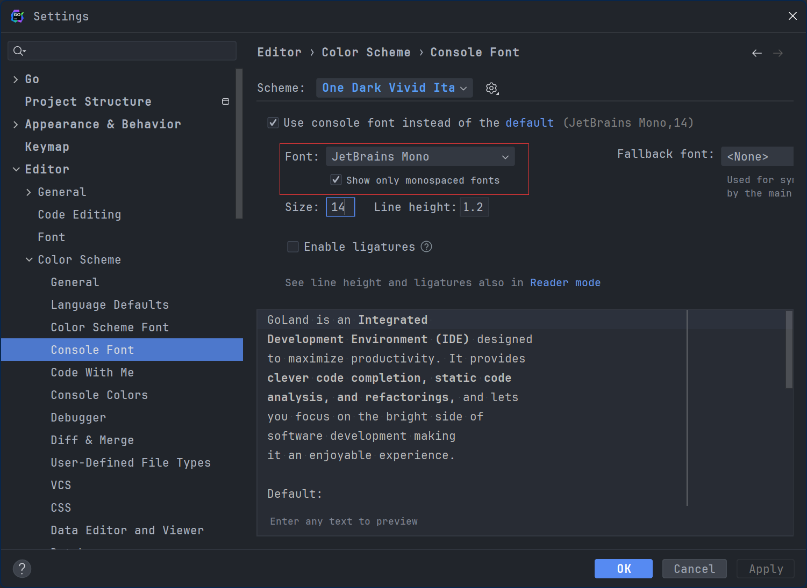

# Go 环境配置

## 安装 Golang

> <https://go.dev/dl/>

1. 从官网下载对应版本的安装包，并直接安装：
   <div align=center></div>

2. 配置项目路径，文件结构如下所示：

    ```text
    └── go
        ├── bin  // 二进制文件，可执行程序，项目
        ├── pkg  // 包文件，存放项目依赖的第三方库
        └── src  // 源文件，存放项目源代码
    ```

3. (Windows) 确认下系统环境路径：
   1. GOROOT：golang 的根目录
   2. GOPATH：golang 的项目目录（步骤二中自定义创建的）
   3. Path：golang 执行路径，一般为 GOROOT/bin
    

4. 配置环境信息：
   1. GOPROXY 决定了 Go 从何处下载依赖包和版本信息，推荐配置下国内代理： `go env -w GOPROXY="https://goproxy.cn,direct"`
   2. GOSUMDB 指定了用于校验模块版本的数据库的名称和地址。当你从模块代理服务器下载一个模块时，Go 也会从 GOSUMDB 指定的数据库下载该模块版本的哈希校验和，并将其和你下载的模块对比，来确保你下载的是正确且未被篡改过的模块。可以配置为：`go env -w GOSUMDB="sum.golang.google.cn"`

5. 命令行执行 `go version`，验证版本信息：
    <div align=center></div>

6. 命令行执行 `go env`，验证最终环境信息：
    

## Goland 基本配置

1. 确认下 GOROOT 配置信息
    

2. 确认下 GOPATH 配置信息：
   

3. Go Modules 是 Go 语言中正式官方发布的项目依赖管理工具，需要确保是启用状态：
   

4. 配置字体信息（注意有多处配置）：
    <div align=center> </div>
    <div align=center> </div>

## Go Pkg 推荐

## Goland 插件配置
