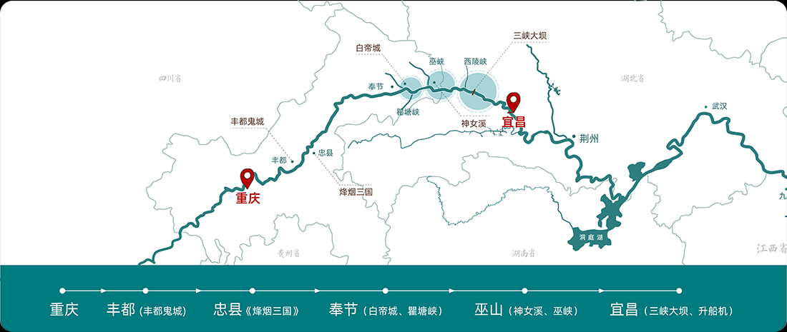
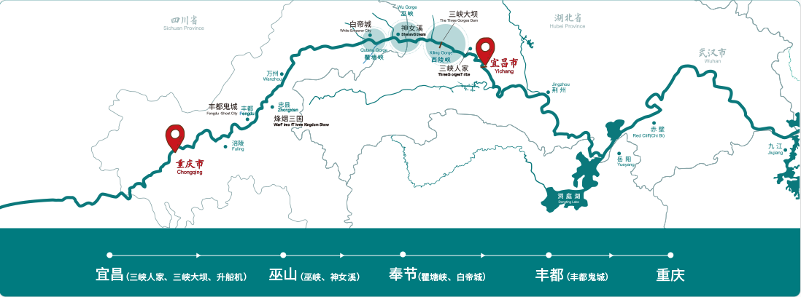
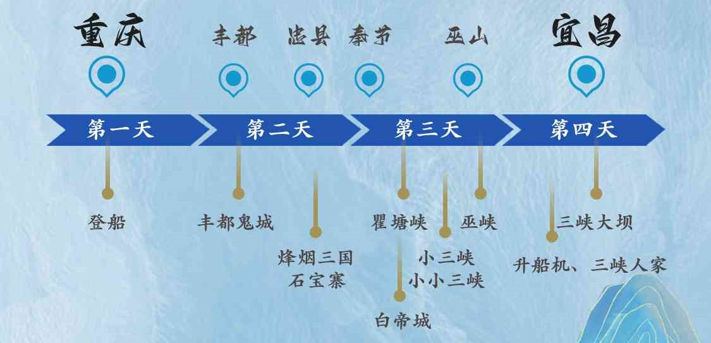
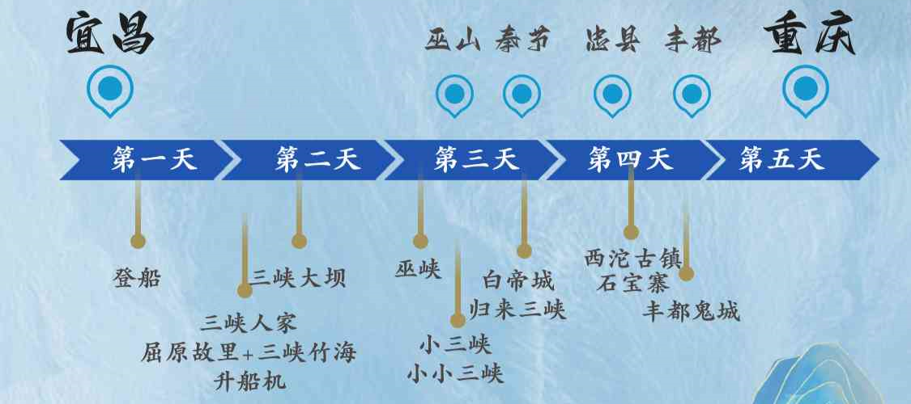

# 长江

> Git 链接：<https://github.com/Chen-23333/Markdown/blob/master/Travel/chang_jiang.md>

## 路线介绍

### 路线

- 下水航线：重庆顺流至宜昌，四天三晚
  - D1：重庆朝天门码头登船
  - D2：丰都鬼城
  - D3：白帝城 + 巫山
  - D4：升船机 + 三峡大坝

- 上水航线：宜昌逆流至重庆，五天四晚
  - D1：宜昌茅坪码头登船，当天不开船
  - D2：升船机 + 三峡大坝
  - D3：巫山 + 白帝城
  - D4：丰都鬼城
  - D5：重庆朝天门离船

各游轮航线主要景点基本一致，即丰都鬼城、巫山小三峡、三峡大坝免费，其他景点自费。

上水的时间更充裕，但是相对应的在船上的时间也会更多，整体耗费的时间更多，景点差距不大，更为推荐下水路线。

### 景点

根据游轮航线不同经过的景点有所不同：

- 下水
  - D2：丰都双桂山、丰都鬼城、石宝寨、烽烟三国
  - D3：白帝城、翟塘峡、巫峡、神女溪、巫山小山峡
  - D4：三峡大坝、三峡升船机、三峡人家、屈原故里

- 上水
  - D2：三峡大坝、三峡升船机、三峡人家、屈原故里
  - D3：西陵峡、白帝城、翟塘峡、巫峡、神女溪、巫山小山峡、归来三峡、神农溪、小小三峡
  - D4：丰都双桂山、丰都鬼城、石宝寨、武陵山大裂谷

升船机(320/人)、三峡人家(290/人)、白帝城(290/人)、小小三峡(170/人)、烽烟三国(290/人)、双桂山(90/人)、大昌古镇(150/人)

## 游轮选择

### 世纪游轮

> <https://www.centurytrip.com/>

- 游轮安排

    | 路线 | 周一 | 周二 | 周三 | 周四 | 周五 | 周六 | 周日 |
    | :--: | :-: | :--: | :-: | :--: | :--: | :-: | :--: |
    | 下水 | 传奇 | 神话 | 凯歌 |     | 远航 | 绿洲 | 荣耀 |
    | 上水 | 远航 | 绿洲 | 荣耀 | 传奇 | 神话 | 凯歌 |      |

  - 远航 24 年、绿洲 23 年、凯歌 22 年、荣耀 19 年、神话/传奇 13 年

- 下水路线

- 上水路线

- 优势
  - 电推力，比较安静
  - 客房超 26 平米，有独立卫生间
  - 观景甲板 2000 平米
  - 随船 WIFI

- 费用
  - 3k（神话/传奇）、4k（凯歌/绿洲/荣耀）、6k（远航）
  - 包含景点丰都鬼城、神女溪、三峡大坝
  - 不含离船当天午、晚餐
  - 烽烟三国、白帝城、三峡人家 290/人，升船机 320/人
  - 丰都鬼城内部交通 20/人，往返 35/人

### 黄金游轮

> <http://www.yangtzegoldcruises.com/>

- 游轮安排差距不大，黄金 2/3/5/6 号 12 年首航，黄金 7/8 号 13 年首航

- 下水路线

- 上水路线

- 费用在 2.5k 左右

## 备注

中途停靠时可以下船，但是要签免责协议，船不等人，且船停靠的地点，绝大部分都是景区，没有多少便利店，所需物品上船前要带齐。

船上信号不好，最好提前准备好书、电影等内容。

晾晒衣服需要自己准备晾衣绳（不确定）

船上的自助餐味道偏淡，需要自备酱菜（不确定）

船上虫子很多。
