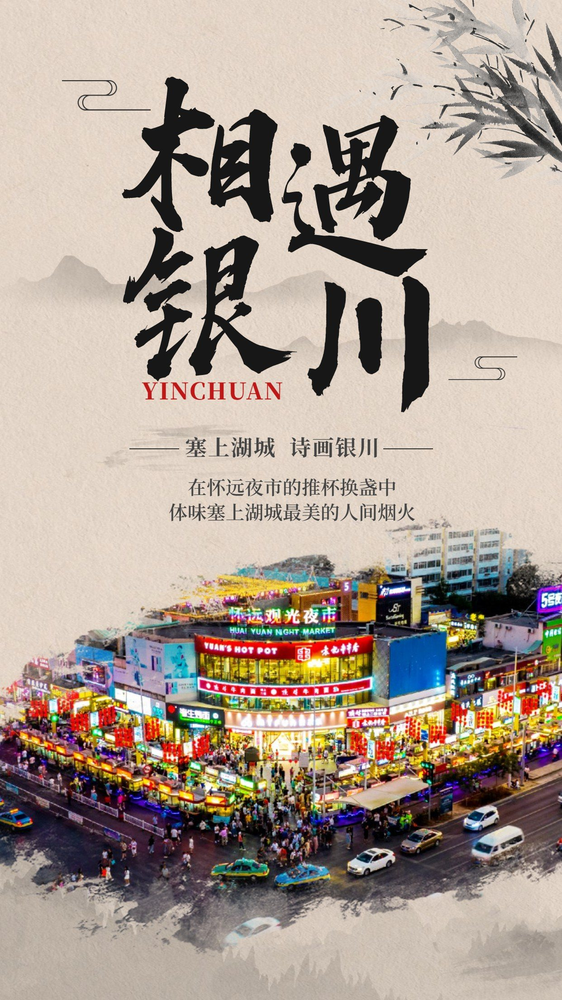
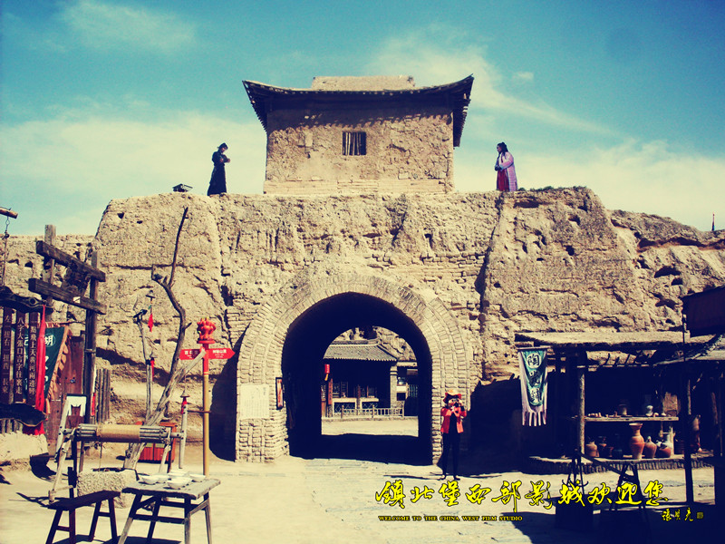
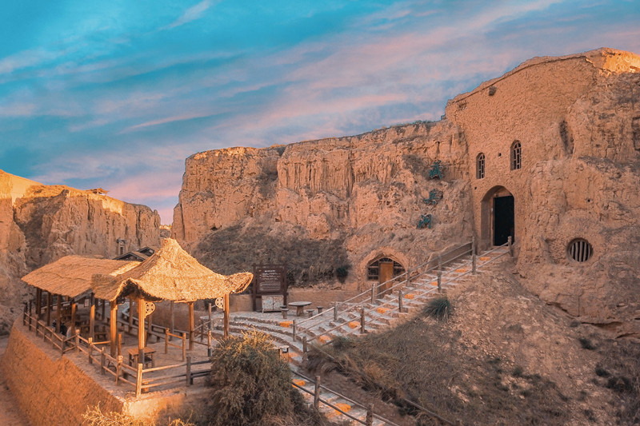
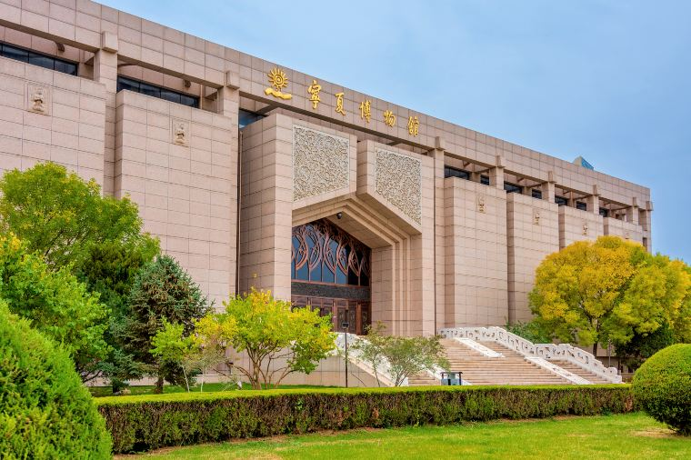
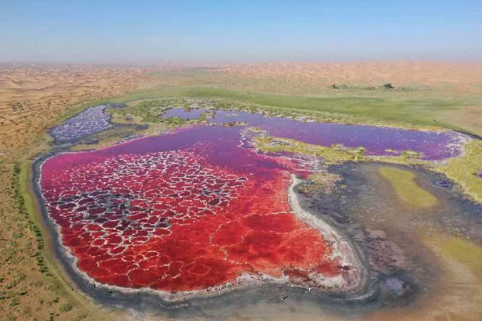
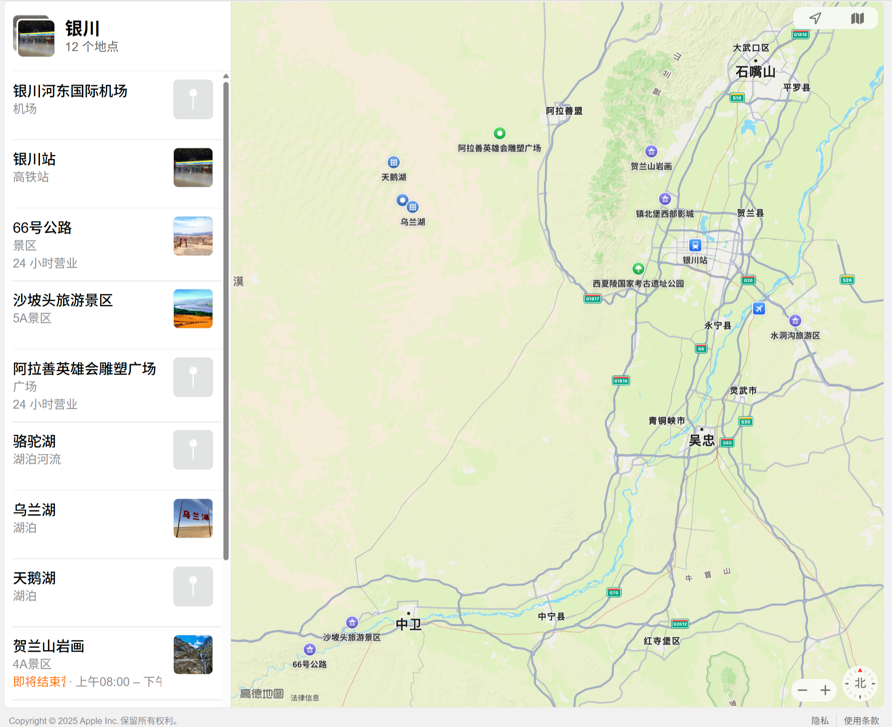

# 银川

> Git 链接：<https://github.com/zhangqian-silk/Markdown/blob/master/travel/银川.md>

## 景点

### 镇北堡西部影城

**一句话亮点：** 步入光影江湖，在“东方好莱坞”重温银幕传奇。

**核心介绍：**
这里是中国电影的摇篮之一，以其苍凉、原始的西北风情，孕育了《红高粱》《大话西游》等上百部经典影片。影城保留了电影拍摄的原始场景，每一处残垣断壁、每一道城门都可能藏着你熟悉的银幕记忆。

**必体验：**

- **穿梭三座古城：**
  - **明城：** 寻访《红高粱》中的“月亮门”与“九儿的家”，感受原始粗犷的边塞豪情。
  - **清城：** 打卡《大话西游》经典城楼，站上至尊宝与紫霞仙子对话的地方，说一句“我爱你”。
  - **老银川一条街：** 漫步于民国时期的复古街市，体验旧时光的市井风情。
- **沉浸式角色扮演：** 租借一套古装或戏服，亲身演绎属于你的电影大片。

**实用贴士：**
建议穿着复古、武侠或牛仔风格的服饰，拍照会非常出片。

### 水洞沟旅游景区

**一句话亮点：** 在同一片土地上，与四万年前的祖先和五百年前的士兵进行一场跨时空对话。

**核心介绍：**

水洞沟的神奇之处，在于它将两个相隔近四万年的遥远时代并置于同一片土地上。这里既是“中国史前考古的发祥地”，保存着四万年前古人类狩猎、生活的珍贵遗迹；同时，它又是中国现存最完整的明代立体军事防御体系所在地，长城、烽燧与地下藏兵洞共同构成了坚固的边塞要塞。

**必体验：**

- **探秘史前文明：** 从博物馆开始，跟随专业讲解，触摸远古人类留下的石器与化石，想象祖先们的生活。
- **揭秘长城秘境：** 深入地下“藏兵洞”，探索机关重重、宛如迷宫的古代军事地道，惊叹于古人的军事智慧。
- **观看实景马战：** 欣赏大型史诗马战剧《北疆天歌》，在金戈铁马与战鼓雷鸣中，感受震撼人心的战争场面。

**实用贴士：**
《北疆天歌》演出场次有限，请务必提前查询当日演出时间，合理规划游览路线，以免错过。参观藏兵洞需跟随景区向导。

### 西夏王陵

**一句话亮点：** 凝望“东方金字塔”，探寻神秘消失的西夏王朝。

**核心介绍：**

贺兰山下，形态独特的“倒扣窝头”形陵墓群静默矗立，这就是西夏王朝的皇家陵园。这个由党项人建立的王朝曾创造了辉煌的文明和独特的文字，却又神秘地消失在历史长河中。作为2025年新晋世界文化遗产，这里是了解这段“失落文明”的最佳窗口。

**必体验：**

- **解码西夏历史：** 参观规模宏大的西夏博物馆新馆，馆藏近5000件珍贵文物，系统了解西夏王朝的兴衰始末。
- **瞻仰帝王陵寝：** 近距离观赏被称为“东方金字塔”的陵塔，感受其雄浑壮阔的气势。
- **漫步艺术碑林：** 欣赏刻有西夏文字的石碑，感受这种“天书”般的文字魅力。

**实用贴士：**

博物馆对面的场馆中，在半点时，会有 3D 电影播放，可先与工作人员询问时间，先行观看。

### 贺兰山岩画

**一句话亮点：** 阅读刻在石头上的史书，与万年之前的灵魂对话。

**核心介绍：**

贺兰山东麓的岩石上，刻录着远古先民在 3000 至 10000 年前的生活图景。这里是“史前人类的艺术长廊”，约 6000 幅内容丰富的岩画，以其生动、质朴的艺术风格，成为解码早期人类文明的珍贵密码。

**必体验：**

- **寻访“太阳神”岩画：** 在众多岩画中找到最富代表性的“太阳神”头像，感受古代先民的原始崇拜。
- **参观世界岩画馆：** 馆内展示了世界范围内的岩画精品，可以进行一场跨越时空的文明对比之旅。
- **欣赏韩美林艺术：** 在韩美林艺术馆，看现代艺术大师如何从古老的岩画中汲取灵感，进行艺术再创作。

**实用贴士：**

景区为户外山地环境，请穿着舒适的鞋子，并做好防晒准备。

### 宁夏博物馆

**一句话亮点：** 一馆览尽塞上千年，西夏珍宝汇聚于斯。

**核心介绍：**

宁夏博物馆是快速了解宁夏历史文化的首选之地。其独特的“回”字形建筑本身就蕴含着地域特色。馆内不仅系统展示了宁夏从远古到近代的通史，更是收藏西夏文物的重镇，众多国宝级文物不容错过。

**必体验：**

- **欣赏镇馆之宝：** 重点关注二楼通史展厅，寻找鎏金铜牛、胡旋舞石刻墓门等国宝级文物。
- **探寻西夏文字：** 细看西夏文的碑文拓片，感受这种神秘文字的独特结构。
- **了解民俗文化：** 前往三楼，了解宁夏作为回族自治区的独特民俗风情与伊斯兰历史文化。

**实用贴士：**
博物馆通常免费对公众开放，但建议提前通过官方渠道预约入场。

### 乌兰湖

**一句话亮点：** 闯入腾格里沙漠腹地，邂逅“地球的心脏”。

**核心介绍：**

这颗遗落在内蒙古阿拉善沙漠深处的“赤色宝石”，因其高空俯瞰下的心形轮廓与血色般的湖水而得名“地球的心脏”。湖水艳丽的红色源于高盐度环境下的嗜盐菌和盐藻，在阳光照射下呈现出令人震撼的视觉奇观。

**必体验：**

- **体验沙漠越野：** 前往乌兰湖的路途本身就是一场探险，乘坐硬派越野车穿越沙海，感受大漠的浩瀚。
- **航拍绝美“心脏”：** 使用无人机从高空拍摄，是捕捉其完整心形和鲜红色彩的最佳方式。
- **定格日落瞬间：** 在沙漠的寂静中，欣赏夕阳将湖水与沙丘染成一片金红的壮丽景色。

**实用贴士：**

最佳观赏期为7-9月，此时高温蒸发量大，湖水盐度高，颜色最为鲜艳，且务必选择晴天前往。在五湖穿越行程中，可以提前吃晕车药，同时注意提前防水鞋套，用于进入乌兰湖。

## 路线参考

### 景点位置

### 旅游团

- 银川五湖一日游
  - 5 座 / 7 座 / 12 座不定，沙漠区域越野车 4 座
  - 价格在 300/人 左右

- 银川中卫两日游
  - 第一天银川出发，穿梭五湖，住宿在沙漠营地
  - 第二天 66 号公路和沙坡头景区，返回银川
  - 价格在 1000/人 左右

- 银川一日游
  - 西夏王陵 + 贺兰山岩画 + 镇北堡西部影城

### 行程安排

- Day1 早上到达，报团一日游
- Day2-3 银川中卫两日游
- Day4 白天自由安排，晚上返程

## Ref

- [“五一”游宁夏∣在诗画银川邂逅美好](http://nx.people.com.cn/n2/2023/0422/c192493-40387487.html)
- [了解银川 - 银川旅游](https://www.yinchuan.gov.cn/sshc/lyjd/zdlyjq/)
- [携程旅游 - 银川景点](https://you.ctrip.com/sight/yinchuan239.html)
