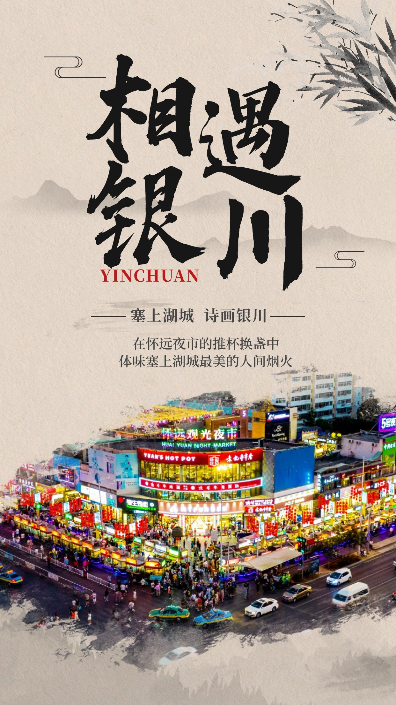

# 银川

> Git 链接：<https://github.com/zhangqian-silk/Markdown/blob/master/travel/银川.md>

## 景点

**镇北堡西部影城**

- 镇北堡西部影城位于银川市西夏区，以其独特的古朴、粗犷、荒凉风格而闻名。这里曾是《牧马人》、《红高粱》、《大话西游》等百余部经典影视作品的拍摄地，吸引了巩俐、姜文、张艺谋、周星驰等众多电影界名人前来。
- 影城主要由明城、清城和老银川一条街三部分构成。游客可沿“8字形”线路游览，在老银川一条街体验20世纪上半叶的市井风情，并品尝羊杂汤等当地特色小吃。
  

 

**水洞沟旅游景区**

- 水洞沟是中国旧石器时代文化遗址，被誉为“中国史前考古的发祥地”。作为国家AAAAA级旅游景区和重点文物保护单位，它记录了四万年前古人类的生存历史。
- 1923年，法国学者在此发现并挖掘出大量石器和动物化石，使水洞沟成为我国最早发现的旧石器时代遗址之一。经过多次考古发掘，至今已出土三万多件石器和67件古动物化石。
- 水洞沟还拥有保存完整的明代军事防御体系，包括长城、烽燧和藏兵洞。其独特的雅丹地貌，经过风沙雕蚀，形成了魔鬼城、卧驼岭等二十多处壮观的土林景观。

 

**西夏陵**

- 西夏陵是银川贺兰山麓的西夏皇家陵园（9帝陵+140陪葬墓），以其独特的倒扣窝头形陵墓著称。
- 西夏王朝由党项人建立，拥有独特的文字和风俗，其历史曾一度神秘失踪，直到近代才被重新发现。
- 景区含博物馆（新馆，六大主题近5000件文物）、艺术馆、碑林，开放部分陵墓（含李元昊泰陵和可近观的昊王陵），是了解神秘西夏王朝及其独特文化的重要窗口，已于2025年成功申遗。

 

**贺兰山岩画**

- 贺兰山岩画景区是全国重点文保单位、国家4A级景区，被誉为“石头上的史书”、“史前人类艺术长廊”、“中华文化溯源地”。
- 遗址区内有约6000幅距今3000-10000年的岩画，以数量庞大、内容丰富、题材广泛、世所罕见而闻名国际。
- 配套有展示全球岩画的“银川世界岩画馆”和韩美林岩画主题艺术馆，现已发展成为融合展览、教育、研学、创作、休闲的综合性旅游目的地。

 

**宁夏博物馆**

- 宁夏博物馆（银川金凤区）平面呈“回”字型布局，呼应宁夏回族自治区。外墙及大门装饰运用迦陵频伽、力士志文支座等宁夏代表性历史建筑构件图案，地域特色鲜明。
- 开放三层展厅：一层含岩画专题展；二层通史展为核心，集中展示西汉至西夏的镇馆之宝（如鎏金铜牛、胡旋舞石门扇）及西夏文拓片；三层侧重回族文化与伊斯兰历史。

 

**乌兰湖**

- 乌兰湖位于内蒙古阿拉善左旗腾格里沙漠腹地，距离银川约2-4小时车程（需穿越沙漠），因从高空俯瞰形似心脏且湖水鲜红如血，被誉为“地球的心脏”。
- 因湖中富含嗜盐菌、盐藻和卤虫（呈红色），夏季高温蒸发使盐浓度升高，红色愈发鲜艳，最佳观赏期为7-9月，同时需要避开雨季，避免湖水稀释变淡。

 

## 路线参考

### 景点位置

### 旅游团

- 银川五湖一日游
  - 5 座 / 7 座 / 12 座不定，沙漠区域越野车 4 座
  - 价格在 300/人 左右

- 银川中卫两日游
  - 第一天银川出发，穿梭五湖，住宿在沙漠营地
  - 第二天 66 号公路和沙坡头景区，返回银川
  - 价格在 1000/人 左右

### 行程安排

**方案一**

- Day0 晚上或 Day1 早上到达
- Day1-2 银川中卫两日游
- Day3 白天自由安排，晚上返程

**方案二**

- Day1 早上到达，剩余时间自由安排
- Day2 五湖一日游
- Day3 白天自由安排，晚上返程

**方案二**

- Day1 早上到达，剩余时间自由安排
- Day2-3 银川中卫两日游
- Day4 白天自由安排，晚上返程

## Ref

- [“五一”游宁夏∣在诗画银川邂逅美好](http://nx.people.com.cn/n2/2023/0422/c192493-40387487.html)
- [了解银川 - 银川旅游](https://www.yinchuan.gov.cn/sshc/lyjd/zdlyjq/)
- [携程旅游 - 银川景点](https://you.ctrip.com/sight/yinchuan239.html)
