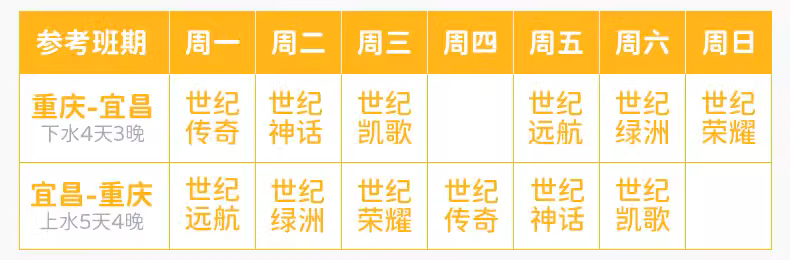
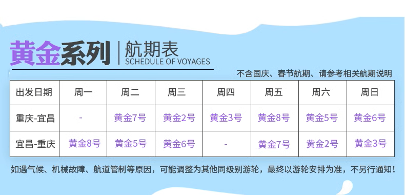
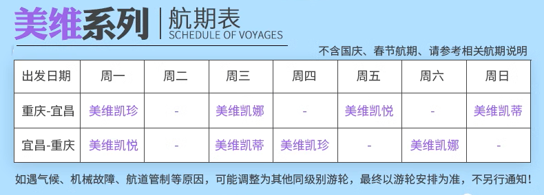
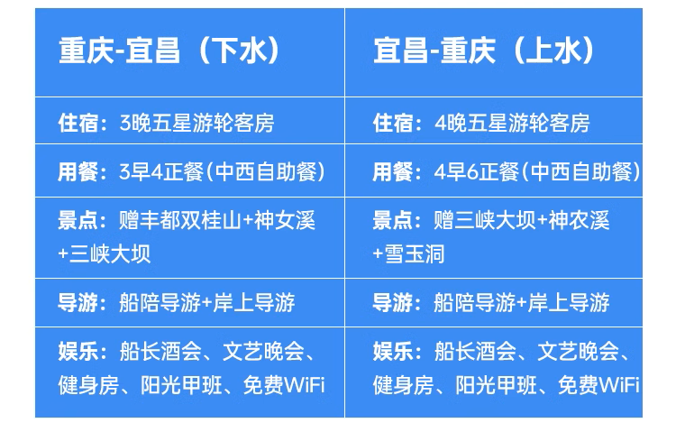
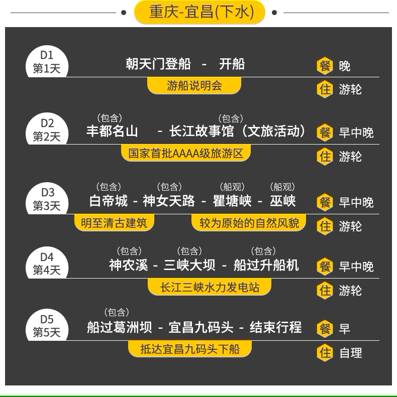
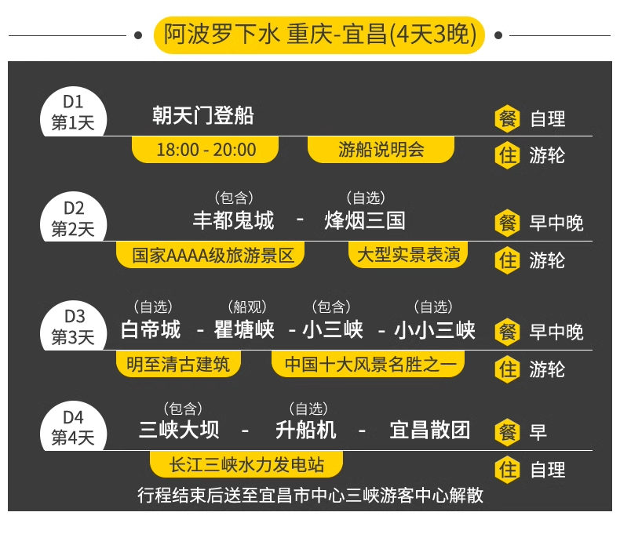
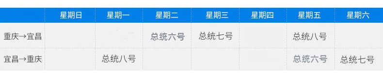
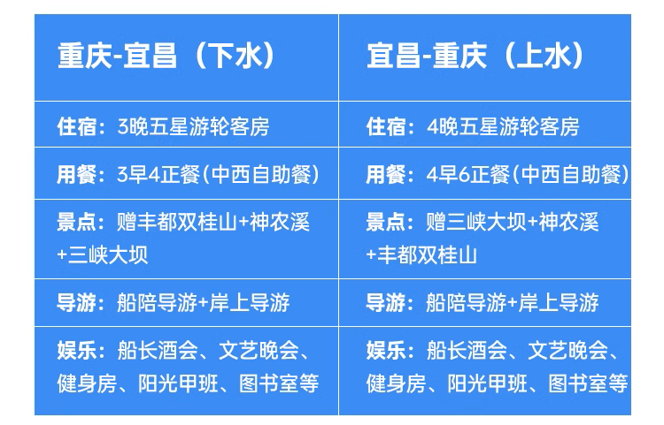

# 长江

> Git 链接：<https://github.com/zhangqian-silk/Markdown/blob/master/travel/长江.md>

## 路线介绍

根据游轮航线不同经过的景点有所不同：

- 下水航线：重庆顺流至宜昌，四天三晚
  - D1：重庆朝天门码头登船
  - D2：丰都双桂山、丰都鬼城、石宝寨、烽烟三国
  - D3：白帝城、翟塘峡、巫峡、神女溪、巫山小山峡
  - D4：三峡大坝、三峡升船机、三峡人家、屈原故里

- 上水航线：宜昌逆流至重庆，五天四晚
  - D1：宜昌茅坪码头登船，当天不开船
  - D2：三峡大坝、三峡升船机、三峡人家、屈原故里
  - D3：西陵峡、白帝城、翟塘峡、巫峡、神女溪、巫山小山峡、归来三峡、神农溪、小小三峡
  - D4：丰都双桂山、丰都鬼城、石宝寨、武陵山大裂谷
  - D5：重庆朝天门离船

上水的时间更充裕，但是相对应的在船上的时间也会更多，整体耗费的时间更多，景点差距不大，更为推荐下水路线。

- 票价（上船后，只能在船上买票）
  - 双桂山(90/人)、丰都鬼城(295/人)、烽烟三国(290/人)、武陵山大裂谷(290/人)
  - 白帝城(290/人)、小小三峡(170/人)
  - 升船机(320/人)、三峡人家(290/人)

## 游轮选择

### 世纪游轮

> <https://www.centurytrip.com/>

- 游轮安排

  

  - 远航 24 年、绿洲 23 年、凯歌 22 年、荣耀 19 年、神话/传奇 13 年
  - 3k（神话/传奇）、4k（凯歌/绿洲/荣耀）、6k（远航）

- 下水路线

  

### 黄金游轮

> <http://www.yangtzegoldcruises.com/>

- 游轮安排

  

  - 黄金 2/3/5/6 号 12 年首航，黄金 7/8 号 13 年首航
  - 2.5k 左右

- 下水路线

  

### 美维游轮

> <http://www.victoriacruises.cc/>

- 游轮安排

  

  - 凯悦 20 年首航，凯珍 16 年装修，凯娜 13 年装修，凯蒂 14 年装修
  - 凯悦 3k，其它 2k

- 路线安排

  

### 长江壹号

- 不同店铺首航时间不一样，有22年首航的新船，也有老船，下水出发时间以实际为准
- 新船价格 4.5k

- 路线安排

  

  - 景点一价全含，但是时间要多花费一天

### 星际阿波罗/雅典娜

- 21年首航，下水出发时间 8.8，8.11，8.14 等等，以实际为准
- 价格 2.5k

- 路线安排
  
  
  
  - 雅典娜不去烽烟三国，去石宝寨，不去小小三峡，船观巫峡

### 总统游轮

- 邮轮安排

  

  - 六号 11 年出厂，七八号 13 年出厂
  - 2.5k 左右

- 路线安排

  

## 备注

中途停靠时可以下船，但是要签免责协议，船不等人，且船停靠的地点，绝大部分都是景区，没有多少便利店，所需物品上船前要带齐。

船上信号不好，最好提前准备好书、电影等内容。

晾晒衣服需要自己准备晾衣绳（不确定）

船上的自助餐味道偏淡，需要自备酱菜（不确定）

船上虫子很多。
